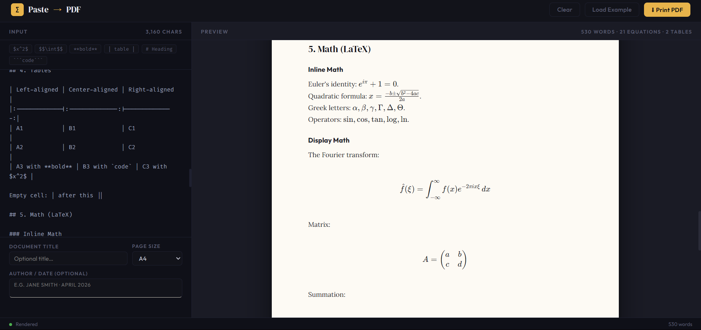

# PasteToDoc – AI Response to PDF

**Paste any ChatGPT, Claude, or Gemini response – get a beautifully formatted PDF with math, tables, and code blocks.**

> Originally inspired by [MassiveMark](https://www.bibcit.com/en/massivemark) (which became paid). This is a free, client‑side alternative that respects your privacy – no data leaves your browser.

 <!-- Add a screenshot later -->

## ✨ Features

- **Markdown + LaTeX** – Headings, lists, tables, blockquotes, inline and display math (`$...$`, `$$...$$`, `\(...\)`, `\[...\]`).
- **Code highlighting** – Fenced code blocks with automatic language detection (via highlight.js if added, or plain monospace).
- **Live preview** – See your document render as you type, with KaTeX math.
- **One‑click PDF export** – Uses the browser’s native print engine (Ctrl+P / Cmd+P) → “Save as PDF”.
- **No server** – 100% static HTML/JS/CSS. Runs offline after first load.
- **Mobile responsive** – Adapts to any screen size; editor and preview stack on narrow screens.
- **Customisable** – Document title, author/date, page size (A4 / Letter).
- **Privacy‑first** – No cookies, no tracking, no data sent to any server.

## 🚀 Live Demo

[**pastetodoc.vercel.app**](https://pastetodoc.vercel.app) – try it instantly.

## 🧪 How to Use

1. Open the app in your browser.
2. Paste an AI response (or any Markdown text) into the left editor.
3. Optionally set a **Document Title** and **Author / Date**.
4. Watch the live preview update on the right (math, tables, code all rendered).
5. Click **Export PDF** → browser print dialog opens.
6. Choose **Save as PDF** (or use your printer).

## 📦 Local Development

You can run the app completely offline – it’s just a single HTML file.

```bash
# Clone the repository
git clone https://github.com/yourusername/pastetodoc.git
cd pastetodoc

# Serve locally (any static server works)
# Using Python 3:
python -m http.server 8000

# Or using npx:
npx serve .
